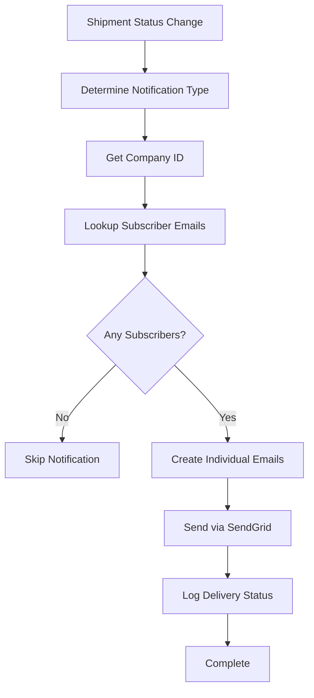

# Notification Subscription System - New Scalable Architecture

## Overview

The notification system has been completely refactored to be more scalable and efficient. Instead of querying users and checking their individual preferences for each notification, the system now stores subscription lists directly in company records.

## Key Improvements

### **Before (Inefficient)**
1. Query all users connected to a company
2. Check each user's notification preferences 
3. Filter users who want to receive the notification
4. Send BCC emails to all recipients

### **After (Scalable)**
1. Look up pre-computed email lists in company record
2. Send individual emails to each subscriber
3. No complex queries or preference checking needed

## Data Structure

### Company Record Structure
Each company document now includes a `notificationSubscriptions` field:

```javascript
{
  companyId: "IC",
  companyName: "Sample Company",
  // ... other company fields
  notificationSubscriptions: {
    shipment_created: [
      "user1@company.com",
      "user2@company.com"
    ],
    shipment_delivered: [
      "user1@company.com",
      "user3@company.com"
    ],
    shipment_delayed: [
      "user2@company.com"
    ],
    status_changed: [
      "user1@company.com",
      "user2@company.com",
      "user3@company.com"
    ]
  }
}
```

### Notification Types
- `shipment_created` - When a new shipment is successfully booked
- `shipment_delivered` - When a shipment is delivered
- `shipment_delayed` - When a shipment is delayed  
- `status_changed` - For any other status updates

## How It Works

### Email Sending Process
1. **Trigger**: Shipment status change occurs
2. **Lookup**: Get subscriber emails from `company.notificationSubscriptions[notificationType]`
3. **Send**: Create individual email for each subscriber (no BCC)
4. **Log**: Track delivery status for each email

### User Preference Management
1. **User toggles notification**: Calls `updateNotificationPreferences` function
2. **System updates company record**: Adds/removes user email from relevant arrays
3. **Hawkeye mode**: If enabled, adds user to ALL notification types

## Cloud Functions

### Core Functions

#### `sendNotificationEmail(type, companyId, data, notificationId)`
Sends notification emails using the new subscription system.

**Parameters:**
- `type` - Notification type (shipment_created, shipment_delivered, etc.)
- `companyId` - Company ID to get subscribers for
- `data` - Email data (shipment details, etc.)
- `notificationId` - Optional notification ID for tracking

**Returns:**
```javascript
{ success: true, count: 3 } // Number of emails sent
```

#### `updateNotificationPreferences(userId, companyId, preferences)`
Updates user's notification subscriptions in the company record.

**Parameters:**
```javascript
{
  userId: "user123",
  companyId: "IC", 
  preferences: {
    shipment_created: true,
    shipment_delivered: false,
    shipment_delayed: true,
    status_changed: true,
    hawkeye_mode: false
  }
}
```

#### `getNotificationPreferences(userId, companyId)`
Gets current notification subscription status for a user.

**Returns:**
```javascript
{
  success: true,
  preferences: {
    shipment_created: true,
    shipment_delivered: false,
    shipment_delayed: true,
    status_changed: true,
    hawkeye_mode: false
  }
}
```

### Migration Function

#### `migrateNotificationSubscriptions(companyId)`
One-time migration function to convert existing user preferences to the new system.

**Usage:**
```javascript
// Call this once per company to migrate existing data
const result = await functions.httpsCallable('migrateNotificationSubscriptions')({ 
  companyId: 'IC' 
});
```

## Frontend Integration

### Updating User Preferences
```javascript
import { httpsCallable } from 'firebase/functions';

const updatePreferences = httpsCallable(functions, 'updateNotificationPreferences');

const handlePreferenceChange = async (newPreferences) => {
  try {
    const result = await updatePreferences({
      userId: currentUser.uid,
      companyId: selectedCompany.id,
      preferences: newPreferences
    });
    
    console.log('Preferences updated:', result.data.subscriptions);
  } catch (error) {
    console.error('Failed to update preferences:', error);
  }
};
```

### Getting Current Preferences
```javascript
const getPreferences = httpsCallable(functions, 'getNotificationPreferences');

const loadCurrentPreferences = async () => {
  try {
    const result = await getPreferences({
      userId: currentUser.uid,
      companyId: selectedCompany.id
    });
    
    setUserPreferences(result.data.preferences);
  } catch (error) {
    console.error('Failed to get preferences:', error);
  }
};
```

## Migration Process

### For Existing Companies

1. **Run Migration**: Call `migrateNotificationSubscriptions` for each company
2. **Verify Results**: Check migration results for any failed users
3. **Update Frontend**: Update UI to use new functions
4. **Test Notifications**: Send test notifications to verify system works

### Example Migration Script
```javascript
const companies = ['IC', 'DWSLOGISTICS', 'TESTCOMPANY'];

for (const companyId of companies) {
  try {
    const result = await functions.httpsCallable('migrateNotificationSubscriptions')({ 
      companyId 
    });
    console.log(`Migration completed for ${companyId}:`, result.data.results);
  } catch (error) {
    console.error(`Migration failed for ${companyId}:`, error);
  }
}
```

## Benefits

### Performance
- **Faster email sending**: No complex user queries
- **Reduced database reads**: Direct lookup of subscriber emails
- **Improved scalability**: O(1) lookup vs O(n) user scanning

### Reliability  
- **Individual emails**: Each recipient gets their own email (better deliverability)
- **Granular tracking**: Track delivery status per recipient
- **Fault tolerance**: Failed emails don't affect others

### Maintainability
- **Simpler logic**: No complex preference checking
- **Cleaner code**: Fewer database queries and operations
- **Better testing**: Easier to test and debug

## Email Sending Flow



## Status and Next Steps

### ✅ Completed
- Refactored email notification system
- Created new subscription management functions
- Updated shipment notification triggers
- Added migration function
- Deployed all changes

### 🔄 Next Steps
1. Run migration for existing companies
2. Update frontend notification preference UI
3. Test notification delivery with new system
4. Monitor performance improvements
5. Remove old notification code after verification

## Support and Troubleshooting

### Common Issues

**No emails being sent**
- Check if company has `notificationSubscriptions` field
- Verify users are subscribed to the notification type
- Check SendGrid logs for delivery issues

**Users not receiving expected notifications**
- Verify user email is in the correct subscription array
- Check if user preferences were migrated correctly
- Confirm notification type matches the event

**Migration fails**
- Check user has valid email address
- Verify company exists in database
- Review migration logs for specific errors

### Debugging
- Check cloud function logs for detailed error messages
- Use `getNotificationPreferences` to verify subscription status
- Monitor `notificationLogs` collection for delivery tracking 